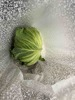

# タイトル
* [キャベツへジャンプ](#white)

## キャベツ

## Reference

[Wikipedia](https://ja.wikipedia.org/wiki/%E3%82%AD%E3%83%A3%E3%83%99%E3%83%84)

### 大根

<blockquote class="twitter-tweet">
大根をそのまま持ち歩いてる人がいたらそれは私です。 <a href="https://t.co/gMY5jSq5a0">pic.twitter.com/gMY5jSq5a0</a>
&mdash; misato nakamura／中村美里 (@misato_n428) <a href="https://twitter.com/misato_n428/status/1452960985262657545?ref_src=twsrc%5Etfw">October 26, 2021</a></blockquote> 
