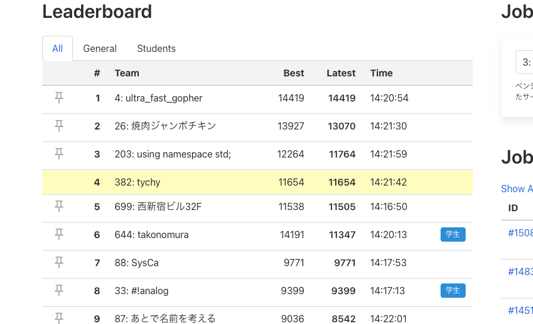
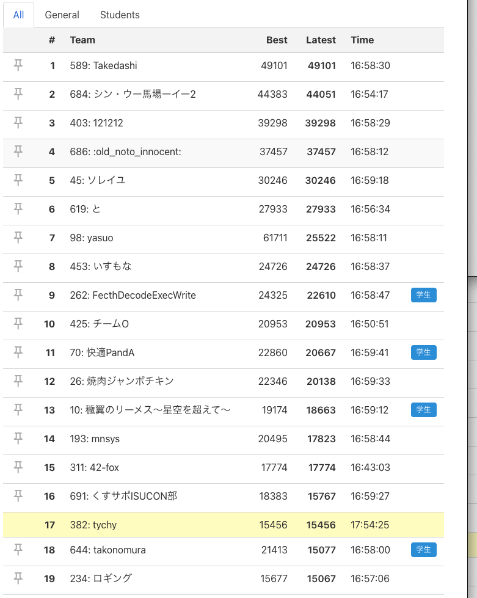

# ISUCON12予選振り返り

## Introduction
ISUCON12予選に参加しました。予選突破はできませんでしたが、振り返りを兼ねて残しておきます。
ログを残していなかったので、コミットログとスクショからざっくり振り返ります。

## 属性

- 初出場

- Go

- 2人チーム

- 15354点

## 準備

事前にISUCON11予選問題を使って以下のようなことを準備していました。
- alp, slow-queryを使えるようにする
- DB、Appの複数台分散

思ったより準備に時間が取れず、基本的なことしか準備できませんでした。

## タイムライン
点数は記録が残っているところだけ書きます。

### 10:19
とりあえずベンチマークを走らせた 初期状態 3000点

初期状態のalpはこんな感じでした。

```
+-------+--------+---------------------------------------+-------+--------+----------+-------+--------+
 | COUNT | METHOD |                  URI                  |  MIN  |  MAX   |   SUM    |  AVG  |  P99   |
 +-------+--------+---------------------------------------+-------+--------+----------+-------+--------+
 |    13 | GET    | /api/admin/tenants/billing            | 0.248 | 20.864 |  117.868 | 9.067 | 20.864 |
 |     1 | POST   | /initialize                           | 3.884 |  3.884 |    3.884 | 3.884 |  3.884 |
 |     9 | POST   | /api/organizer/players/add            | 2.052 |  4.984 |   31.000 | 3.444 |  4.984 |
 |    59 | POST   | /api/organizer/competition/.+/score   | 0.116 | 14.192 |  144.404 | 2.448 | 14.192 |
 |   748 | GET    | /api/player/competition/.+/ranking    | 0.004 | 14.632 | 1148.740 | 1.536 | 14.464 |
 |   602 | GET    | /api/player/player/.+                 | 0.004 | 14.452 |  815.744 | 1.355 | 14.064 |
 |    23 | GET    | /api/organizer/billing                | 0.004 |  1.276 |    4.564 | 0.198 |  1.276 |
 |    11 | POST   | /api/admin/tenants/add                | 0.004 |  0.060 |    0.284 | 0.026 |  0.060 |
 |    42 | POST   | /api/organizer/competitions/add       | 0.004 |  0.040 |    0.952 | 0.023 |  0.040 |
 |   120 | GET    | /api/player/competitions              | 0.004 |  0.040 |    1.380 | 0.012 |  0.040 |
 |    38 | POST   | /api/organizer/competition/.+/finish  | 0.004 |  0.028 |    0.432 | 0.011 |  0.028 |
 |    14 | POST   | /api/organizer/player/.+/disqualified | 0.004 |  0.024 |    0.148 | 0.011 |  0.024 |
 |    27 | GET    | /api/organizer/players                | 0.028 |  0.028 |    0.148 | 0.005 |  0.028 |
 |     1 | GET    | /css/app.83b4c321.css                 | 0.000 |  0.000 |    0.000 | 0.000 |  0.000 |
 |     1 | GET    | /js/app.3a4ec98c.js                   | 0.000 |  0.000 |    0.000 | 0.000 |  0.000 |
 |     1 | GET    | /index.html                           | 0.000 |  0.000 |    0.000 | 0.000 |  0.000 |
 |     1 | GET    | /api/organizer/competitions           | 0.000 |  0.000 |    0.000 | 0.000 |  0.000 |
 +-------+--------+---------------------------------------+-------+--------+----------+-------+--------+
```


### 10:47
とりあえず`/api/player/player`でbulk insertできそうなところがあったので改善。3538点

```
+-------+--------+---------------------------------------+-------+--------+---------+-------+--------+
 | COUNT | METHOD |                  URI                  |  MIN  |  MAX   |   SUM   |  AVG  |  P99   |
 +-------+--------+---------------------------------------+-------+--------+---------+-------+--------+
 |    27 | GET    | /api/admin/tenants/billing            | 0.000 | 20.812 |  95.848 | 3.550 | 20.812 |
 |     9 | POST   | /api/organizer/players/add            | 1.844 |  4.608 |  29.080 | 3.231 |  4.608 |
 |     1 | POST   | /initialize                           | 3.048 |  3.048 |   3.048 | 3.048 |  3.048 |
 |    55 | POST   | /api/organizer/competition/.+/score   | 0.004 |  7.960 |  86.136 | 1.566 |  7.960 |
 |   745 | GET    | /api/player/competition/.+/ranking    | 0.000 |  8.372 | 738.436 | 0.991 |  8.148 |
 |   624 | GET    | /api/player/player/.+                 | 0.004 |  8.256 | 565.916 | 0.907 |  7.648 |
 |    22 | GET    | /api/organizer/billing                | 0.004 |  1.944 |   7.088 | 0.322 |  1.944 |
 |    12 | POST   | /api/admin/tenants/add                | 0.000 |  0.104 |   0.412 | 0.034 |  0.104 |
 |    39 | POST   | /api/organizer/competitions/add       | 0.008 |  0.052 |   0.968 | 0.025 |  0.052 |
 |    35 | POST   | /api/organizer/competition/.+/finish  | 0.004 |  0.032 |   0.464 | 0.013 |  0.032 |
 |   110 | GET    | /api/player/competitions              | 0.004 |  0.044 |   1.408 | 0.013 |  0.040 |
 |    13 | POST   | /api/organizer/player/.+/disqualified | 0.004 |  0.012 |   0.116 | 0.009 |  0.012 |
 |    27 | GET    | /api/organizer/players                | 0.000 |  0.020 |   0.136 | 0.005 |  0.020 |
 |     1 | GET    | /css/app.83b4c321.css                 | 0.000 |  0.000 |   0.000 | 0.000 |  0.000 |
 |     1 | GET    | /js/app.3a4ec98c.js                   | 0.000 |  0.000 |   0.000 | 0.000 |  0.000 |
 |     1 | GET    | /api/organizer/competitions           | 0.000 |  0.000 |   0.000 | 0.000 |  0.000 |
 |     1 | GET    | /index.html                           | 0.000 |  0.000 |   0.000 | 0.000 |  0.000 |
 |     1 | GET    | /                                     | 0.000 |  0.000 |   0.000 | 0.000 |  0.000
  +-------+--------+---------------------------------------+-------+--------+----------+-------+--------+
```


## ~14時頃
mysql二台構成に変更して、slow-queryのログを見ながら

```
% sudo mysqldumpslow -s t /tmp/slow-query.log

Reading mysql slow query log from /tmp/slow-query.log
Count: 1213  Time=0.10s (120s)  Lock=0.00s (0s)  Rows=101.4 (123054), isucon[isucon]@localhost
  SELECT player_id, MIN(created_at) AS min_created_at FROM visit_history WHERE tenant_id = N AND competition_id = 'S' GROUP BY player_id

Count: 4889  Time=0.01s (31s)  Lock=0.01s (45s)  Rows=0.0 (0), isucon[isucon]@localhost
  REPLACE INTO id_generator (stub) VALUES ('S')

Count: 1  Time=2.20s (2s)  Lock=0.00s (0s)  Rows=0.0 (0), isucon[isucon]@localhost
  DELETE FROM visit_history WHERE created_at >= 'S'

Count: 116  Time=0.01s (1s)  Lock=0.00s (0s)  Rows=0.0 (0), isucon[isucon]@localhost
  INSERT INTO visit_history (player_id, tenant_id, competition_id, created_at, updated_at) VALUES ('S', N, 'S', N, N)

Count: 3  Time=0.01s (0s)  Lock=0.00s (0s)  Rows=0.0 (0), isucon[isucon]@localhost
  #

Count: 1  Time=0.02s (0s)  Lock=0.00s (0s)  Rows=0.0 (0), isucon[isucon]@localhost
  INSERT INTO tenant (name, display_name, created_at, updated_at) VALUES ('S', 'S', N, N)

Count: 1  Time=0.01s (0s)  Lock=0.00s (0s)  Rows=0.0 (0), isucon[isucon]@localhost
  DELETE FROM tenant WHERE id > N

Count: 3  Time=0.00s (0s)  Lock=0.00s (0s)  Rows=0.0 (0), 0users@0hosts
  administrator command: Prepare
```


`CREATE INDEX talent_competition ON player_score(tenant_id, competition_id, player_id, row_num DESC);`

のようにindexを張ったり、
[n+1を直してみたり](https://github.com/ISUCON-tychy/isucon12-qualify/commit/adad29f89c958db97e81daaba22e2a2084e8ebcb)していました。点数は4000点台だったような記憶。

## 14:23
id_generatorが遅いことに気がつく。uuidでいいじゃんと思い切り替える。　[411962ea7acddd2cbe598063185ff4f1cfe02a36](https://github.com/ISUCON-tychy/isucon12-qualify/commit/411962ea7acddd2cbe598063185ff4f1cfe02a36)

この瞬間が最高順位でした。



## ~17時頃
```
% make alp
 +-------+--------+---------------------------------------+-------+--------+----------+-------+--------+
 | COUNT | METHOD |                  URI                  |  MIN  |  MAX   |   SUM    |  AVG  |  P99   |
 +-------+--------+---------------------------------------+-------+--------+----------+-------+--------+
 |     1 | POST   | /initialize                           | 2.320 |  2.320 |    2.320 | 2.320 |  2.320 |
 |    39 | GET    | /api/admin/tenants/billing            | 0.004 | 44.872 |   82.176 | 2.107 | 44.872 |
 |    13 | POST   | /api/organizer/players/add            | 0.904 |  2.980 |   21.636 | 1.664 |  2.980 |
 |    65 | GET    | /api/organizer/billing                | 0.004 | 14.984 |   39.784 | 0.612 | 14.984 |
 |  2854 | GET    | /api/player/competition/.+/ranking    | 0.004 | 30.000 |  973.212 | 0.341 |  4.180 |
 |  5550 | GET    | /api/player/player/.+                 | 0.004 | 30.004 | 1845.084 | 0.332 |  3.384 |
 |   116 | POST   | /api/organizer/competition/.+/score   | 0.008 | 12.104 |   27.452 | 0.237 |  3.208 |
 |    12 | POST   | /api/admin/tenants/add                | 0.036 |  0.728 |    1.076 | 0.090 |  0.728 |
 |   379 | GET    | /api/player/competitions              | 0.004 |  0.256 |   17.680 | 0.047 |  0.152 |
 |    94 | POST   | /api/organizer/competitions/add       | 0.004 |  0.504 |    2.804 | 0.030 |  0.504 |
 |    90 | POST   | /api/organizer/competition/.+/finish  | 0.004 |  0.120 |    2.452 | 0.027 |  0.120 |
 |    76 | GET    | /api/organizer/players                | 0.004 |  0.248 |    1.844 | 0.024 |  0.248 |
 |    19 | POST   | /api/organizer/player/.+/disqualified | 0.004 |  0.072 |    0.408 | 0.021 |  0.072 |
 |     1 | GET    | /js/app.3a4ec98c.js                   | 0.000 |  0.000 |    0.000 | 0.000 |  0.000 |
 |     1 | GET    | /index.html                           | 0.000 |  0.000 |    0.000 | 0.000 |  0.000 |
 |     1 | GET    | /css/app.83b4c321.css                 | 0.000 |  0.000 |    0.000 | 0.000 |  0.000 |
 |     1 | GET    | /api/organizer/competitions           | 0.000 |  0.000 |    0.000 | 0.000 |  0.000 |
 +-------+--------+---------------------------------------+-------+--------+----------+-------+--------+
 
 % sudo mysqldumpslow -s t /tmp/slow-query.log
 Reading mysql slow query log from /tmp/slow-query.log
 Count: 1  Time=2.23s (2s)  Lock=0.00s (0s)  Rows=0.0 (0), isucon[isucon]@isuports-3.t.isucon.dev
   DELETE FROM visit_history WHERE created_at >= 'S'
 
 Count: 13  Time=0.05s (0s)  Lock=0.00s (0s)  Rows=3972.4 (51641), isucon[isucon]@isuports-3.t.isucon.dev
   SELECT player_id, MIN(created_at) AS min_created_at FROM visit_history WHERE tenant_id = N AND competition_id = 'S' GROUP BY player_id
 
 Count: 10  Time=0.01s (0s)  Lock=0.00s (0s)  Rows=0.0 (0), isucon[isucon]@isuports-3.t.isucon.dev
   INSERT INTO visit_history (player_id, tenant_id, competition_id, created_at, updated_at) VALUES ('S', N, 'S', N, N)
 
 Count: 1  Time=0.01s (0s)  Lock=0.00s (0s)  Rows=0.0 (0), isucon[isucon]@isuports-3.t.isucon.dev
   DELETE FROM tenant WHERE id > N
```
slow-queryがmysqlに対してしか流せていなかった　＆ pprofの設定をしてなかったので手詰まり感があった。
`/api/player/player`、`/api/player/competition/.+/ranking `、`/api/admin/tenants/billing`、が遅いのはalpからわかっていたのでできそうな修正を細かくしていった。 13000点前後

## 17:52
あまり点数が伸びなかったので、再起動試験をせずに開発を継続した。

`% sudo tail -f /var/log/syslog`を見ればログが見れることに気が付き、[n+1をもう一つギリギリで修正](https://github.com/ISUCON-tychy/isucon12-qualify/commit/c29cec9e87f97732259f9f13f7182dfdc0683949)




### 最終順位
47位でした！

## 感想
- `% sudo tail -f /var/log/syslog` などでアプリのログを見ることができる事に16時頃まで気が付かなかった
  - デバッグが大変だった
- sqliteに接続できないと思いこんでいた
  - `% sqlite`で接続できた

事前の試行錯誤（準備）が不十分で、デバッグの方法も確立できていなかったのが一番の敗因だと思いました。

一方で、開き直ってできることをやるというのが功を奏して思っていたよりよい順位になれました。とても楽しかったです。


## Reference

https://github.com/ISUCON-tychy/isucon12-qualify

https://isucon.net/
