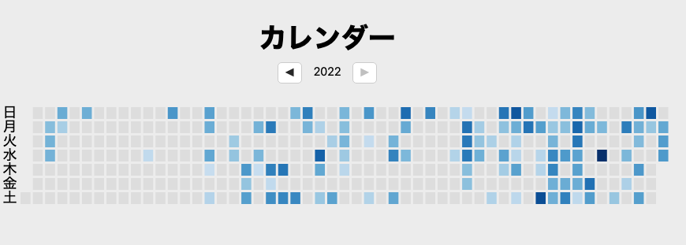
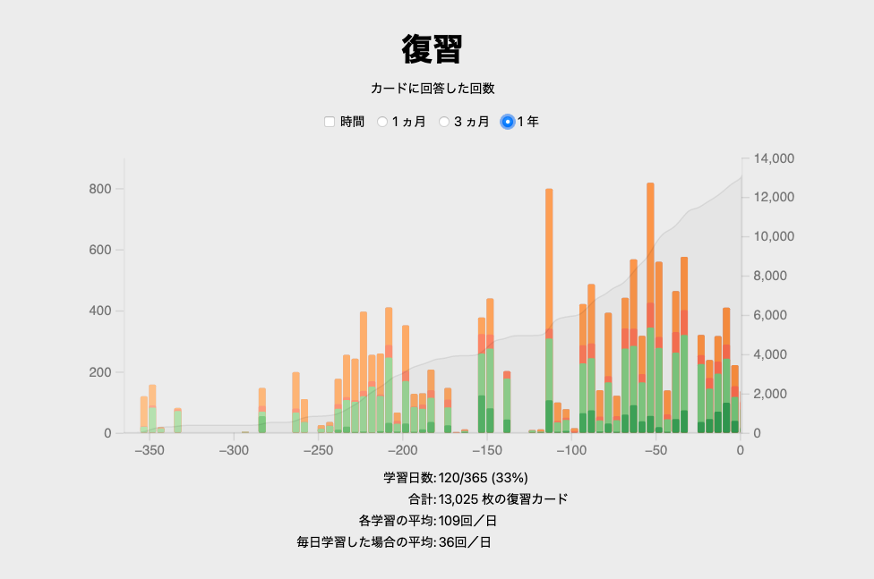

---
Keywords:
Copyright: (C) 2022 Ryu Yamada
---

#年末休みDay1 12/28

お休みを12/28 - 1/9まで入手した。夏季休暇を取るタイミングを見失っていたので初めて4日以上休む気がする。

### エンジニアリングマネージャーのしごと
ムーブを研究しているので、気になった。今日少し読んだ。

#### Chapter1
最初の１週間のムーブについて。チームメンバー、上司と話をしよう。チームの現時点での状態と問題を把握しよう。それだけで十分仕事をしている。

#### Chapter2
マネージャーは仕事が一人で完結しづらく、コードを一人で完成させることのできるエンジニアに比べて達成感を感じづらい。
情報収集、意思決定、ナッジング、ロールモデルの活動に分類することを通して満足感を見つけよう。

マネージャーのアウトプット=チームのアウトプット (+影響を与えた他のチームのアウトプット)である。迷ったらここに戻ってこれば良い。

### 今年の英語学習の振り返り

情報源を毎週の英会話、YoutubeのBBC Newsと名探偵ポワロに設定していた。
こう見るとかなりムラがあるが、一年間継続的にできたのは良かった。
かなり成長を感じた。

### 休み中になんとかしたいこと
このブログ自体が完成していないので、本の内容を完遂する。

[フルスクラッチから1日でCMSを作る シェルスクリプト高速開発手法入門](
https://tatsu-zine.com/books/shellscript-cms-2ed)