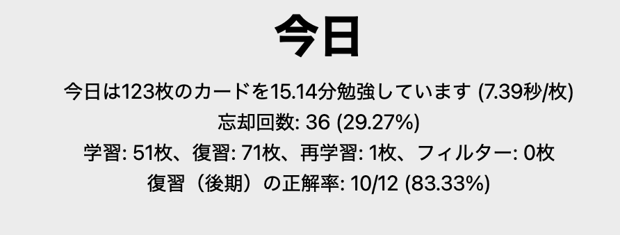
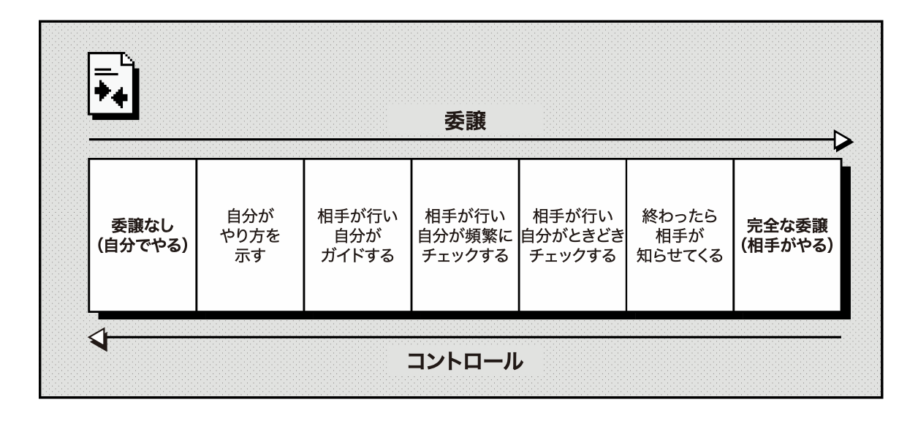

# Day3 12/30

## 英語
昨日頑張ったので今日はかなり少ない。ノートからAnkiに追加したいと思ってた分を処理する。

## フランス語
ついにやり始めた。
[フラ語入門、わかりやすいにもホドがある！](https://www.hakusuisha.co.jp/book/b472214.html)を休み中にやりきりたい。
今日は1,2,3課の内容をやった。

- リエゾン
Champs-Èlysées
直後の母音と結びつくことで発音されなかった子音が復活する

- アンシェンヌマン
avec un café
もともと読んでいた最後の子音が直後の母音と一緒に発音される

- エリジオン
ce,de,je,la,le,me,ne,que,se,teの次に母音が来ると合体する
la arc -> l'arc

"Je vous en prie"がパッと品詞分解できないので考えた。

## エンジニアリングマネージャーのしごと
### Chapter3
マネージャーとしての振る舞いに一貫性をもたせよう。自分の振る舞いをレビューしよう。
フィードバックをするときには徹底的に本音で行うこと。

(P51からの引用)委譲の程度を使い分けよう。訓練で上達できる。

### Chapter4
上司との1on1はサマリを作る良い機会だと思ったら良い。
（会社でやっていることそのまま書いてあったのでうなずいていたら終わった。）

## 運動
ストレッチ　https://www.youtube.com/watch?v=Re5FPU5_37g
https://www.youtube.com/watch?v=0jhnX8BPzes

## 休暇中にやりたいこと
- ブログ整備
- フランス語の本一周

OS自作はやりたいけど大変すぎるなぁ...

## ブログ整備
半年詰まっていたところをrewriteしたら動いた。。。
キーワードにリンクを作ることはできたが、key.cgiの整備をしないと機能しない状態。
https://bashcms.tychy.jp/key.cgi?key=Wine
