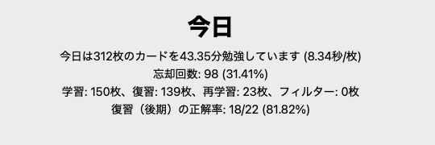

# 年末休みDay5 1/1

## 英語
Anki今日はちょっと多めだった。

## DCMA 1201
[Standing up for developers: youtube-dl is back](https://github.blog/2020-11-16-standing-up-for-developers-youtube-dl-is-back/)を読んだ。軽くまとめる。

a Digital Millennium Copyright Act(DMCA)に基づくyoutube-dlの規制と復帰についての文章。

* TPM

 a technical protection measure

* DMCAに基づく侵害の主張

たいていのDMCAに基づく申立は、著作権侵害に基づくものであるが、youtube-dlに対するものは"anticirmumvention"に分類されるものだった。著作権保護された情報へのアクセスやコピーを制御する技術を回避するためのコードだという申立(1201)だった。

* 対応

youtube-dlを申し立てを受けて、まずプロジェクトを閉鎖した。[申立](https://github.com/github/dmca/blob/master/2020/10/2020-10-23-RIAA.md)はfolkのリポジトリも対象にしていたが、著作権保護されたコンテンツをDownloadできなくするような[patch](https://github.com/animelover1984/youtube-dl/commit/0851123c1909558268e8e237214d9c466cf5198d)を当てたfolkを存続させた。
その後、youtube-dlが[実際にはDMCAのanticircumvention](https://github.com/github/dmca/blob/master/2020/11/2020-11-16-RIAA-reversal-effletter.pdf)を侵害していないことを確認して、youtube-dlのプロジェクトを復活させた。

* 今後の対応
  * DMCA 1201の申立に対する行動指針を作成
  * 開発者が申立に立ち向かいたい際に支援する基金をGithubが立ち上げ1M$を寄付する
  * DMCA自体を改善する取り組みをすすめるとともにもっとひどい法律が世界中で作られることを防ぐ
  * DMCA 1201を廃止する取り組みをする

