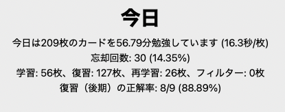

# 年末休みDay6 1/2

フランス語をかなりサボっている。。。

## 英語

## ヤード・ポンド法
~~~~~~~code
12 inch = 1 feet

36 inch = 3 feet = 1 yard

1 inchは25.4mm、1 feetは304.8mm、1 yardは 914.4mm(= 0.9144m)
~~~~~~~

whole nine yardsという何から何までという意味の表現があるが意外と広くないんだなと思った。

面積についても調べる。

~~~~~~~
1 acre = 43560 feet^2 = 4047 m^2
~~~~~~~

「雄牛2頭引きの犂を使って1人が1日で耕すことのできる面積」[(出典 wikipedia)](https://ja.wikipedia.org/wiki/%E3%82%A8%E3%83%BC%E3%82%AB%E3%83%BC)という意味に由来するらしい。ドイツ、スペインにも同じような単位があるようだ。
ロッド、ハロンとの関連についても整理する。

~~~~~~~
1 acre = 40 rod * 40 rod = 1 furlong * 1 furlong(ハロン)
~~~~~~~

わかりやすい。

~~~~~~~
1 furlong = 40 rod = 220 yard = 660 feet

1 rod = 16.5 feet
~~~~~~~

## 運動
ストレッチ　https://www.youtube.com/watch?v=Re5FPU5_37g
https://www.youtube.com/watch?v=0jhnX8BPzes

瑞穂運動場西　→　新瑞橋　→　堀田　→　牛巻　→　瑞穂運動場西　のランニングをした。

 